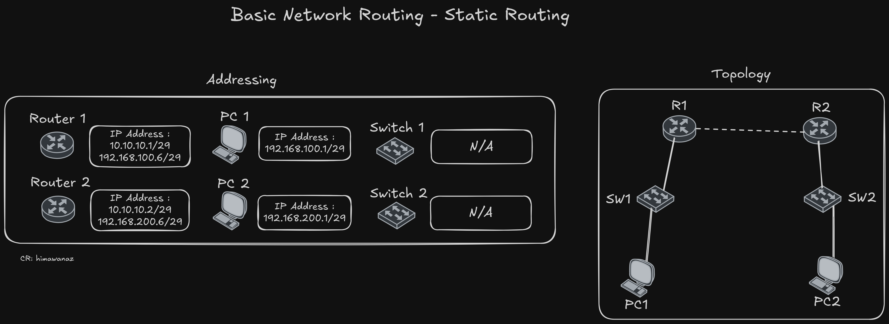
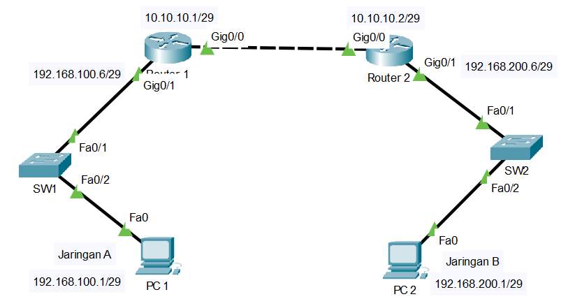

# jaringan-dasar-static-routing
Panduan Jaringan Dasar - Static Routing dengan Cisco Packet Tracer

# Static Routing

# Cisco Packet Tracer Topology

# Addressing Table

| Perangkat  | Interface  | IP Address       | Subnet Mask        | Gateway          |
|------------|------------|------------------|---------------------|------------------|
| Router 1   | Gig0/0     | 10.10.10.1       | 255.255.255.248     | -                |
| Router 1   | Gig0/1     | 192.168.100.6    | 255.255.255.248     | -                |
| Router 2   | Gig0/0     | 10.10.10.2       | 255.255.255.248     | -                |
| Router 2   | Gig0/1     | 192.168.200.6    | 255.255.255.248     | -                |
| Switch 1   | -          | N/A              | N/A                 | N/A              |
| Switch 2   | -          | N/A              | N/A                 | N/A              |
| PC 1       | Fa0        | 192.168.100.1    | 255.255.255.248     | 192.168.100.6    |
| PC 2       | Fa0        | 192.168.200.1    | 255.255.255.248     | 192.168.200.6    |
